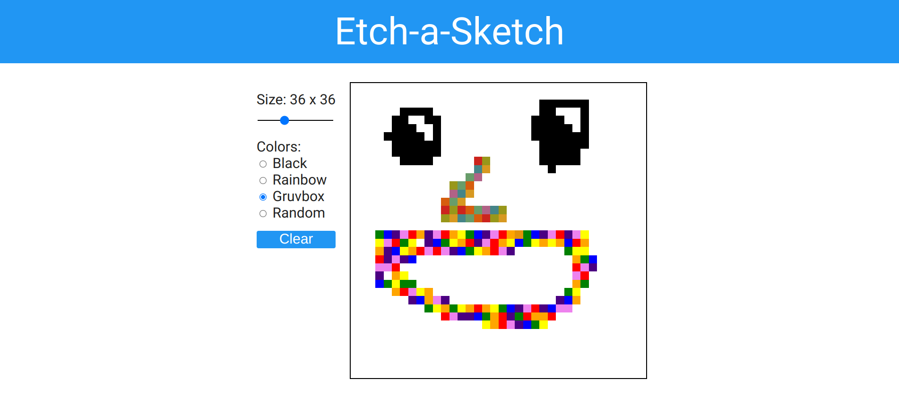

#Etch-a-Sketch
Sketchpad webpage for doodling

Created with HTML, CSS, and JavaScript

**Github Pages Preview** [here](https://ramishafikovca.github.io/etch-a-sketch)

##Features:
Specify your canvas size from a slider

4 color modes: Black, Rainbow, Gruvbox, and Random

Reset/clear the canvas

 